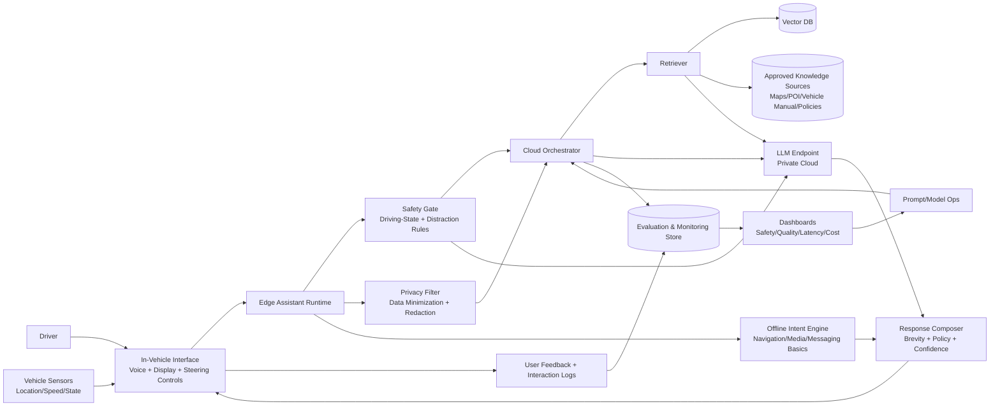

# System Architecture

## Component View

## Interaction Flow
1. Driver request enters through voice/HMI interface.
2. Edge runtime checks driving state and applies distraction constraints.
3. Privacy filter removes unnecessary sensitive fields before cloud call.
4. If offline or low confidence for cloud path, offline intent engine provides safe fallback.
5. Cloud orchestrator retrieves approved context and calls LLM endpoint.
6. Response composer enforces brevity, policy, and confidence thresholding.
7. Final response is delivered to HMI with safe interaction modality.
8. Telemetry flows into evaluation dashboards for continuous improvement.

## RAG Relevance
RAG is relevant because:
- Vehicle capabilities, policies, and regional context must remain up to date.
- Grounded retrieval reduces hallucination risk for navigation and vehicle guidance.
- Retrieval scope can be restricted by policy and driving context.

## Scalability and Reliability Controls
- Regional autoscaling for cloud inference.
- Edge fallback for core intents during network interruptions.
- Circuit breakers for model timeouts and degraded mode routing.

## Security and Compliance Controls
- Explicit consent controls for personalization.
- Encryption in transit and at rest.
- Immutable audit trails for generated outputs and policy events.
- Region-aware retention and access policies.
